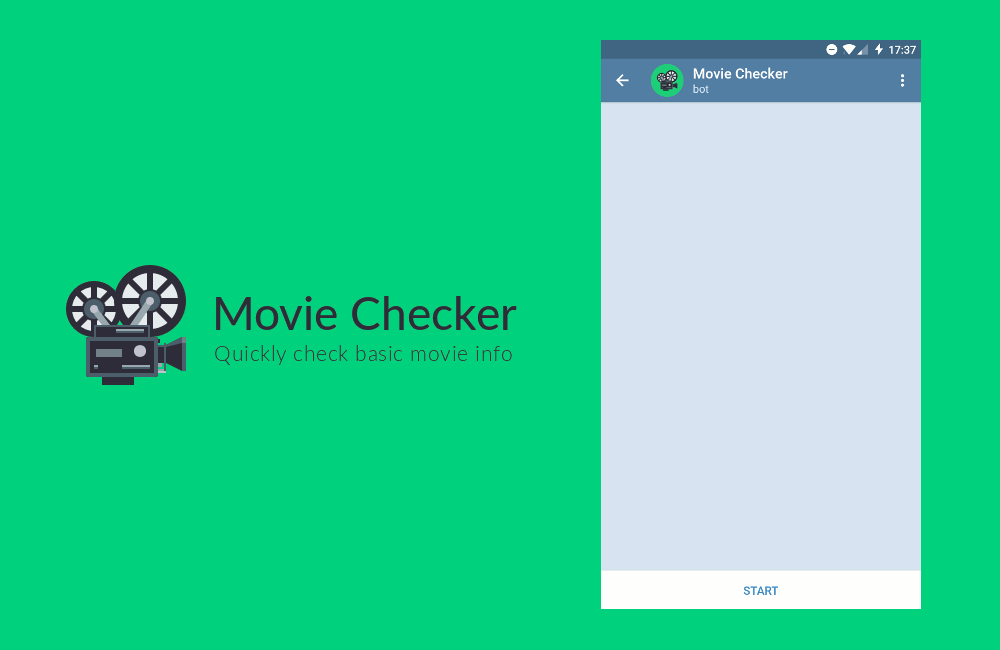

# Movie Checker

Movie Checker is a [Telegram](https://telegram.org/) bot that helps you quickly check basic movie information, such as release date, runtime or cast and crew members. It also gives you links to external websites like [TMDb](https://www.themoviedb.org/), [IMDb](http://www.imdb.com/) and [Letterboxd](https://letterboxd.com/) for additional details. Open a chat with [@MovieCheckerBot](http://telegram.me/MovieCheckerBot) on Telegram to try it out.

## Technology

The bot is built with [Node.js](https://nodejs.org) and a few libraries to help with various things: [Slimbot](https://github.com/edisonchee/slimbot) for the bot itself, [MovieDB](https://github.com/impronunciable/moviedb) for fetching movie data and [date-fns](https://date-fns.org/) for manipulating JavaScript dates. [Babel](http://babeljs.io/) is used for transpiling. The bot is deployed with [Zeit's Now](https://zeit.co/now).

## Acknowledgments

All movie information comes from the [TMDb API](https://www.themoviedb.org/documentation/api), which is pretty great and free to use. The bot icon is just [EmojiOne](https://www.emojione.com)'s film projector emoji with [TMDb](https://www.themoviedb.org)'s green accent color as background.

## License and issues

The source code of the bot is released under the MIT License. The full text of the license is available in the [LICENSE file](LICENSE). If you find any errors or have suggestions for this project, please [open an issue](https://github.com/soyguijarro/movie-checker-bot/issues) and I'll do my best to help.
